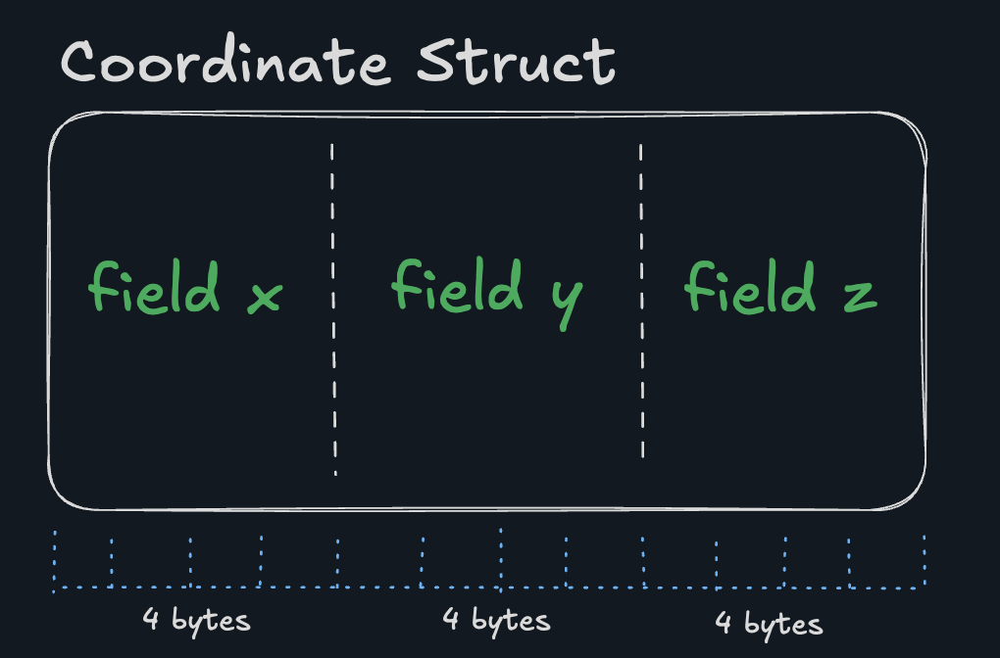

# CH2: Structs | L1: Structs
So far all we’ve seen are the simple (non-collection) types in C. However, stuff like this can get really annoying:

```c
int main() {
    int x_1 = 1;
    int y_1 = 2;
    int z_1 = 3;
    int x_2 = 4;
    int y_2 = 5;
    int z_2 = 6;

    int dist = distance(x_1, y_1, z_1, x_2, y_2, z_2);
    printf("Distance: %d", dist);
}
```

Because our distance function starts to look… ridiculous.

```c
int distance(int x_1, int y_1, int z_1,
             int x_2, int y_2, int z_2)
{
    // a lot of numbers
}
```

We also run into a new problem: In C, we’re only allowed to return a single value from a function. This doesn’t work:

```
int int int scale_coordinate(int x, int y, int z, int scale) {
    return x * scale, y * scale, z * scale;
    // Error! Too many values to return
}
```

Structs solve this. Here’s an example of the syntax:

```c
struct Human {
    int age;
    char *name;
    int is_alive;
};
```

# CH2: Structs | L2: Initializers
So now you’re probably wondering: “Hey TJ, so… how do we actually make an instance of a struct”? You may have noticed in the previous lesson all we did was define the struct type.

Unfortunately, there are a few different ways to initialize a struct, I’ll give you an example of each using this struct:

```c
struct City {
  char *name;
  int lat;
  int lon;
};
```

Zero Initializer

```c
int main() {
  struct City c = {0};
}
```

This sets all the fields to 0 values.
Positional Initializer

```c
int main() {
  struct City c = {"San Francisco", 37, -122};
}
```

Designated Initializer
This is my (generally) preferred way to initialize a struct. Why?
- It’s easier to read (has the field names)
- If the fields change, you don’t have to worry about breaking the ordering

```c
int main() {
  struct City c = {
    .name = "San Francisco",
    .lat = 37,
    .lon = -122
  };
}
```

Remember, it’s .name not name. If this trips you up, just remember it’s .name and not name because that’s how you access the field, e.g. c.name.
Accessing Fields

Accessing a field in a struct is done using the . operator. For example:

```c
struct City c;
c.lat = 41; // Set the latitude
printf("Latitude: %d", c.lat); // Print the latitude
```

Note: There’s another way to do this for pointers that we’ll get to later.

```main.c
#include "munit.h"

#include "coord.h"

munit_case(RUN, test_new_coordinate1, {
  struct Coordinate c;
  c.x = 1;
  c.y = 2;
  c.z = 3;

  assert_int(c.x, ==, 1, "should set x");
  assert_int(c.y, ==, 2, "should set y");
  assert_int(c.z, ==, 3, "should set z");
});

munit_case(SUBMIT, test_new_coordinate2, {
  struct Coordinate c = new_coord(4, 2, 0);

  assert_int(c.x, ==, 4, "should set x");
  assert_int(c.y, ==, 2, "should set y");
  assert_int(c.z, ==, 0, "should set z");
});

int main() {
  MunitTest tests[] = {
    munit_test("/create_coordinate1", test_new_coordinate1),
    munit_test("/create_coordinate2", test_new_coordinate2),
    munit_null_test,
  };

  MunitSuite suite = munit_suite("coordinates", tests);

  return munit_suite_main(&suite, NULL, 0, NULL);
}
```

```coord.h
#pragma once

struct Coordinate {
  int x;
  int y;
  int z;
};

struct Coordinate new_coord(int x, int y, int z);
```

```coord.c
#include "coord.h"

struct Coordinate new_coord(int x, int y, int z) {
  struct Coordinate coord = {
    .x = x,
    .y = y,
    .z = z
  };
  return coord;
}
```

# CH2: Structs | L3: Scaling Coordinate
Remember how we can not return multiple values from a function in C? We can’t do this:

```
int, char * become_older(int age, char *name) {
  return age + 1, name;
}
```

However, we can accomplish effectively the same thing by returning a struct:

```c
struct Human become_older(int age, char *name) {
  struct Human h = {.age = age, .name = name};
  h.age++;
  return h;
}
```

```main.c
#include "munit.h"

#include "coord.h"

munit_case(RUN, test_new_coordinate, {
  struct Coordinate c;
  c.x = 1;
  c.y = 2;
  c.z = 3;

  assert_int(c.x, ==, 1, "should set x");
  assert_int(c.y, ==, 2, "should set y");
  assert_int(c.z, ==, 3, "should set z");
});

munit_case(RUN, test_scale_coordinate1, {
  struct Coordinate c = new_coord(1, 2, 3);
  struct Coordinate scaled = scale_coordinate(c, 2);

  assert_int(scaled.x, ==, 2, "should scale x");
  assert_int(scaled.y, ==, 4, "should scale y");
  assert_int(scaled.z, ==, 6, "should scale z");
});

munit_case(SUBMIT, test_scale_coordinate2, {
  struct Coordinate c = new_coord(4, 2, 0);
  struct Coordinate scaled = scale_coordinate(c, 2);

  assert_int(scaled.x, ==, 8, "should scale x");
  assert_int(scaled.y, ==, 4, "should scale y");
  assert_int(scaled.z, ==, 0, "should scale z");
});

int main() {
  MunitTest tests[] = {
    munit_test("/create_coordinate", test_new_coordinate),
    munit_test("/test_scale_coordinate1", test_scale_coordinate1),
    munit_test("/test_scale_coordinate2", test_scale_coordinate2),
    munit_null_test,
  };

  MunitSuite suite = munit_suite("coordinates", tests);

  return munit_suite_main(&suite, NULL, 0, NULL);
}
```

```coord.h
#pragma once

struct Coordinate {
  int x;
  int y;
  int z;
};

struct Coordinate new_coord(int x, int y, int z);

struct Coordinate scale_coordinate(struct Coordinate coord, int factor);
```

```coord.c
#include "coord.h"

struct Coordinate new_coord(int x, int y, int z) {
  struct Coordinate coord = {.x = x, .y = y, .z = z};
  return coord;
}

struct Coordinate scale_coordinate(struct Coordinate coord, int factor) {
  struct Coordinate scaled_coord = {
    .x = coord.x * factor,
    .y = coord.y * factor,
    .z = coord.z * factor,
  };
  return scaled_coord;
}
```

# CH2: Structs | L4: Typedef
By now, you’re probably tired of typing struct Coordinate over and over again, and you’re wondering “How can I make my struct types easier to write, like int?”

Good news! C can do this with the typedef keyword.

```c
struct Pastry {
    char *name;
    float weight;
};
```

This can also be written as:

```c
typedef struct Pastry {
    char *name;
    float weight;
} pastry_t;
```

Now, you can use pastry_t wherever before you would have used struct Pastry. Note: The _t at the end is a common convention to indicate a type.

In fact, you can optionally skip giving the struct a name:

```c
typedef struct {
    char *name;
    float weight;
} pastry_t;
```
In this case you’d only be able to refer to the type as pastry_t. In general, I do give the struct an actual name (e.g. Pastry), but I only use the typedef’d type. We’ll be using this convention in this course.

```main.c
#include "munit.h"

#include "coord.h"

munit_case(RUN, test_new_coordinate, {
  coordinate_t c = new_coord(1, 2, 3);

  assert_int(c.x, ==, 1, "should set x");
  assert_int(c.y, ==, 2, "should set y");
  assert_int(c.z, ==, 3, "should set z");
});

munit_case(RUN, test_scale_coordinate, {
  coordinate_t c = new_coord(1, 2, 3);
  coordinate_t scaled = scale_coordinate(c, 2);

  assert_int(scaled.x, ==, 2, "should scale x");
  assert_int(scaled.y, ==, 4, "should scale y");
  assert_int(scaled.z, ==, 6, "should scale z");
});

int main() {
  MunitTest tests[] = {
    munit_test("/create_coordinate", test_new_coordinate),
    munit_test("/test_scale_coordinate", test_scale_coordinate),
    munit_null_test,
  };

  MunitSuite suite = munit_suite("coordinates", tests);

  return munit_suite_main(&suite, NULL, 0, NULL);
}
```

```coord.h
#pragma once

typedef struct {
  int x;
  int y;
  int z;
} coordinate_t;

coordinate_t new_coord(int x, int y, int z);
coordinate_t scale_coordinate(coordinate_t coord, int factor);
```

```coord.c
#include "coord.h"

coordinate_t new_coord(int x, int y, int z) {
  coordinate_t coord = {.x = x, .y = y, .z = z};
  return coord;
}

coordinate_t scale_coordinate(coordinate_t coord, int factor) {
  coordinate_t scaled = coord;
  scaled.x *= factor;
  scaled.y *= factor;
  scaled.z *= factor;
  return scaled;
}
```

# CH2: Structs | L5: Sizeof
As we saw earlier, sizeof can be used to view the size of a type (for once, programmers thought of a name that was actually helpful). But this isn’t just true of builtin types like int or float, you can also use it to find out the size of structs!

`printf("Size of coordinate_t: %zu bytes\n", sizeof(coordinate_t));`

Memory Layout
Structs are stored contiguously in memory one field after another. Take this struct:

```c
typedef struct Coordinate {
    int x;
    int y;
    int z;
} coordinate_t;
```

Assuming int is 4 bytes, the memory layout for coordinate_t would look like:



Mixed Type Structs

```c
typedef struct Human{
    char first_inital;
    int age;
    double height;
} human_t;
```

Assuming char is 1 byte, int is 4 bytes, and double is 8 bytes, the memory layout for human_t might look like this:


Wait! What is that padding doing here?

It turns out that CPUs don’t like accessing data that isn’t aligned (incredible oversimplification alert, since obviously CPUs don’t have feelings (yet)), so C inserts padding to maintain alignment (e.g. every 4 bytes in this example).

Huge caveat: these layouts can vary depending on the compiler and system architecture.


# CH2: Structs | L6: Struct padding
There are a bunch of complicated rules and heuristics that different compilers use to determine how to lay out your structs. But to oversimplify:
1. The fields of a struct are laid out in memory contiguously (next to each other)
2. Structs can vary in size depending on how they are laid out.

C is a language that aims to give tight control over memory, so the fact that you can control the layout of your structs is a feature, not a bug.

Compilers + modern hardware + optimizations + skill issues means that sometimes what you think the computer is going to do isn’t exactly what it actually does. That said, C is designed to get you close to the machine and allows you to dig in and figure out what’s going on if you want to for a specific compiler or architecture.

As a rule of thumb, ordering your fields from largest to smallest will help the compiler minimize padding:

```c
typedef struct {
  char a;
  double b;
  char c;
  char d;
  long e;
  char f;
} poorly_aligned_t;

typedef struct {
  double b;
  long e;
  char a;
  char c;
  char d;
  char f;
} better_t;
```
